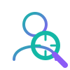

# 🕵️‍♂️ UnfollowerDetector

<p align="center">
  
</p>

**UnfollowerDetector** is a beautiful, local Python web app that helps you find Instagram accounts you follow that do **not** follow you back.

It works with your official Instagram data export, compares your followers and following lists, and shows a clean, interactive dashboard of non-mutual follows with clickable profile links.

---

## ✨ Features

* 🔍 **Smart Detection**: Instantly find users who don't follow you back.
* 📁 **Drag & Drop Uploads**: Simply drag your downloaded Instagram `.zip` export, the `followers_and_following` folder, or the raw `.json` files directly into the app.
* 🎨 **Premium UI**: Dark-themed, glassmorphic design that feels modern and responsive.
* 🖥️ **100% Local**: Runs entirely on your computer. Your data never leaves your machine.
* 🔗 **Direct Links**: Open any Instagram profile directly from the dashboard to review or unfollow.
* ⭐ **Whitelisted**: Keep track of celebrities, brands, or friends you want to follow regardless.
* 💤 **Inactive**: Mark abandoned accounts so they don't clutter your main list.
* ✅ **Unfollowed**: Keep a record of users you've manually unfollowed.
* 🗑️ **Clear Data**: Securely wipe all loaded data and statuses from your machine at any time.
* 🔐 **No Login Required**: No Instagram password required, completely safe from bans.

---

## 📸 What It Does

UnfollowerDetector parses your official Instagram data export (`following.json` and `followers_*.json`) and calculates the exact difference. 

It provides an interactive dashboard where you can easily filter, search, and categorize accounts into different tabs (Unfollowers, Whitelisted, Inactive, Unfollowed).

---

## 🛡️ Privacy First

Your data stays on your own computer.

UnfollowerDetector does **not** ask for your Instagram login details and does **not** connect to your Instagram account or use any unauthorized APIs. It strictly parses the JSON files you provide.

---

## 📦 Installation

**Requires Python 3.7 or higher.**

### 1. Clone the repository

```bash
git clone https://github.com/YOUR_USERNAME/UnfollowerDetector.git
cd UnfollowerDetector
```

### 2. No dependencies required!

UnfollowerDetector is built using only Python's standard library. You do **not** need to install any external packages or use `pip`.

---

## 🚀 Running the App

Start the backend server with:

```bash
python main.py
```

Then open your browser and go to:

```txt
http://127.0.0.1:8080
```

---

## 📥 Getting Your Instagram Data

To use the app, download your Instagram information:

1. Go directly to **[Your Information and Permissions](https://accountscenter.instagram.com/info_and_permissions/dyi/)** (or navigate manually from Settings).
2. Click **Download your information** → **Download or transfer information**.
3. Select your Instagram account.
4. Choose **Some of your information** and select **Followers and following**.
5. Set the format to **JSON** and create the file.

When the download is ready, you'll receive a `.zip` file. You can drag this exact `.zip` file directly into UnfollowerDetector!

---

## 🧭 How to Use

When you open the app, you can provide your data in three ways:

1. **Upload the ZIP**: Drag and drop the `.zip` file you downloaded from Instagram. The app will automatically extract what it needs.
2. **Upload the Folder**: Extract the ZIP yourself and drag the `connections` or `followers_and_following` folder into the app.
3. **Upload the JSON files**: Drag and drop `following.json` and `followers_1.json` together.

Once processed, you will be taken to the dashboard.

---

## 🏷️ User Statuses

You can organize detected users using the action buttons next to their names:

### ⚪ Normal (Unfollowers)
Users who do not follow you back. This is the default state.

### ⭐ Whitelisted
Users who don't follow you back, but you still want to follow (e.g., celebrities, brands, news pages).

### 💤 Inactive
Users whose accounts appear to be dormant or abandoned.

### ✅ Unfollowed
Users you have manually reviewed and unfollowed on Instagram. Keeping them here gives you a record of your actions.

---

## ⚠️ Disclaimer

This project is not affiliated with Instagram or Meta.

UnfollowerDetector does not log in to Instagram, scrape data, or perform automatic unfollow actions. It only helps you analyze your own exported data and review accounts manually.
